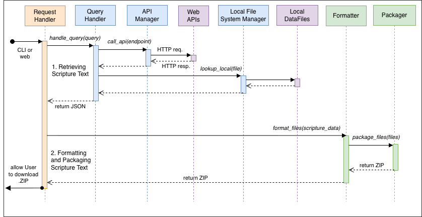

# MATTE (Manípulus Attestatiónum / Sheaf of Testimonies)

> Builds multilingual parallel scripture passages

A tool that allows for creating side-by-side scripture citations in two or three languages (Latin/English/French/Etc.). And also having configurable options for visuals and styling.

## System Requirements

- Python 3.13 or newer

## Usage

From the root directory:  
`python src/matte/matte.py -i “path/to/input.json” -o “/somewhere/there” -c “path/to/config.json”`

### Development

#### Options / Help dialog

From the root directory:  
`python -m src/matte/matte -h`

## Hackathon Planning

- **[TO-DO LIST](./hackathon-todo.md)**
- Original Planning doc: https://docs.google.com/document/d/1oKVF5h6FuXo1RusaRipKQqUHm7PCtn5oe76i4ZPhkk8/edit?usp=sharing

## Design & Documentation

Structure - System Diagram

### Documentation

- [Feature Set](./design/feature-set.md)
- [Interface](./design/interface.md)
- [Structure](./design/structure.md)
- [Tools](./design/tools.md)
- [Data Sources](./design/data-sources.md)
- [Models / Entities](./design/entities.md)

## Guild of St. Isidore (TO)

Founded just one month before the announcement of the All Saints Hackathon, the GSI was founded to try and bring open-source software culture to church. The Guild of St. Isidore builds free and open source tools and plugins for Catholic parishes and the creative community.  
Headquartered in Toronto, 🇨🇦

GSI's GitHub:  https://github.com/guild-st-isidore-TO

### Inaugural project: EdiMeli (Editoris Melicorum)

GSI's music typesetting toolkit

Repository: https://github.com/guild-st-isidore-TO/edimeli  

Presentation for [Creative Code TO](https://creativecodetoronto.github.io/):  
https://www.youtube.com/watch?v=-J6NshzFpCY
