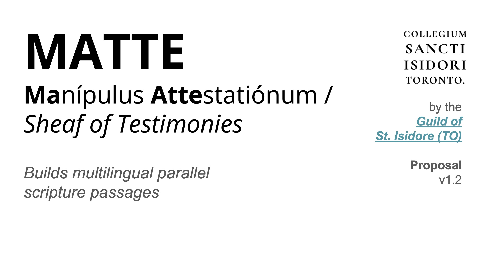
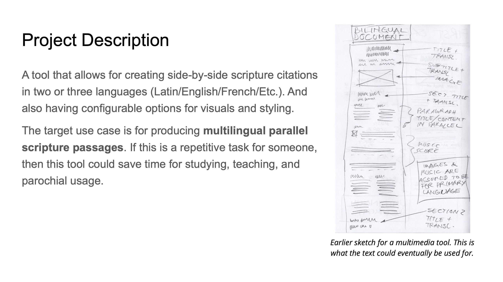
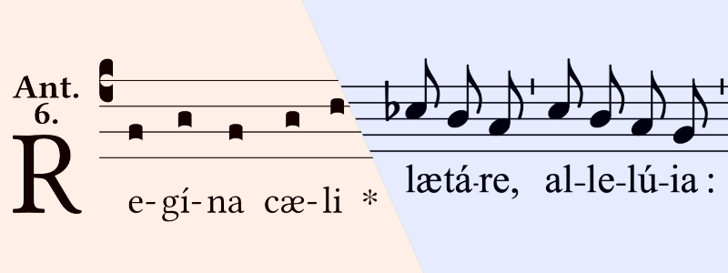

# MATTE (Manípulus Attestatiónum / Sheaf of Testimonies)

> Builds multilingual parallel scripture passages

A tool that allows for creating side-by-side scripture citations in two or three languages (Latin/English/French/Etc.). And also having configurable options for visuals and styling.

## Design & Documentation

- [Feature Set](./design/feature-set.md)
- [Interface](./design/system-design-interface.md)
- [Structure](./design/system-design-structure.md)

## Guild of St. Isidore (TO)

Founded just one month before the announcement of the All Saints Hackathon, the GSI was founded to try and bring open-source software culture to church. The Guild of St. Isidore builds free and open source tools and plugins for Catholic parishes and the creative community.  
Headquartered in Toronto, 🇨🇦

GSI's GitHub:  https://github.com/guild-st-isidore-TO

### Inaugural project: EMEL (Editoris Melicorum)

GSI's music typesetting toolkit

Repository: https://github.com/guild-st-isidore-TO/editorismelicorum  

Presentation for [Creative Code TO](https://creativecodetoronto.github.io/):  
https://www.youtube.com/watch?v=-J6NshzFpCY
