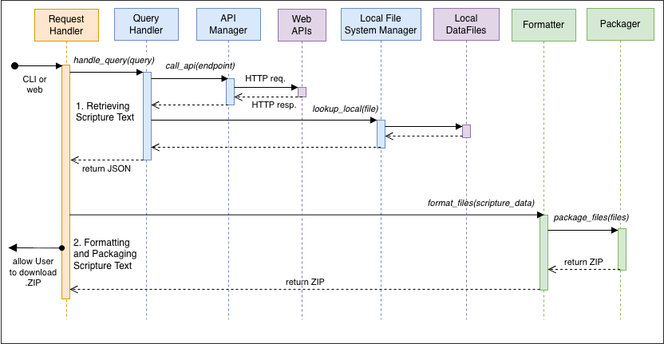

# SYSTEM MODELS / ENTITIES

[Back to README](../README.md)

Models and entities used throughout the system.

## Main modules

### Request Handler

- `handle_request(req_json)`

### Query Handler

- `handle_query(query)`
- `lookup_api(api_job)`
- `lookup_local(local_job)`

### API Manager

- `call_api(endpoint)`

### Local File System Manager

- `lookup_local(file)`

### Formatter

- `format_files(scripture_data)`

### Packager

- `package_files(files)`
