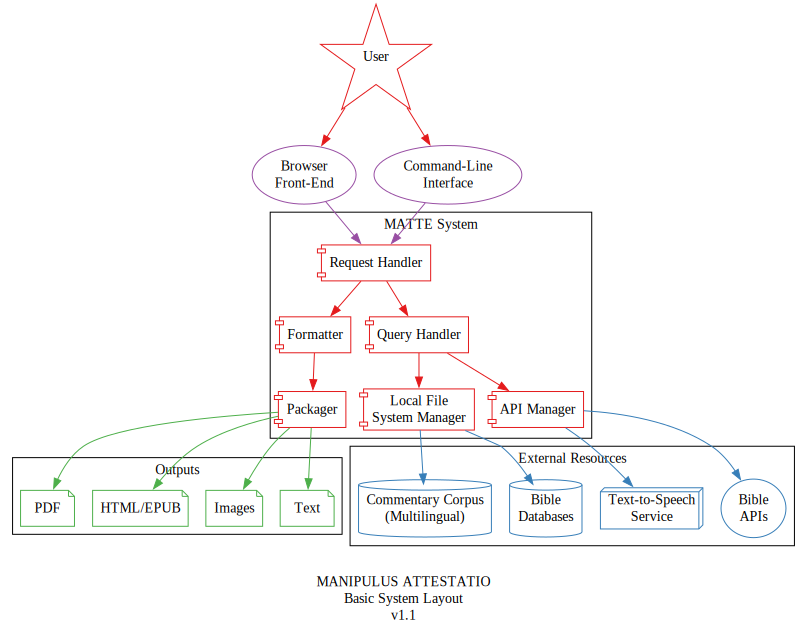
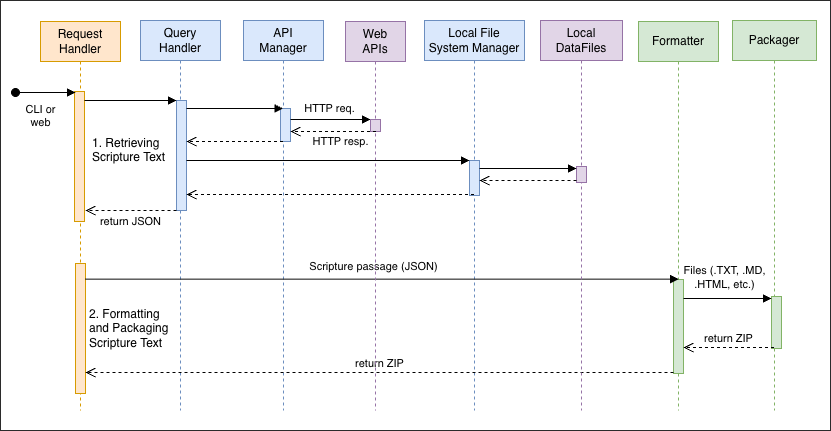

# IMPLEMENTATION (STRUCTURE)

## File / Directory Structure

- `/` – project root
    + `matte/` – Python module and related files
    + `config/` – anything related to settings/config
    + `input/` - input files & mockups
    + `output/` - place for output files
    + `data/` – local data files

## System Diagram

## Sequence Diagram

